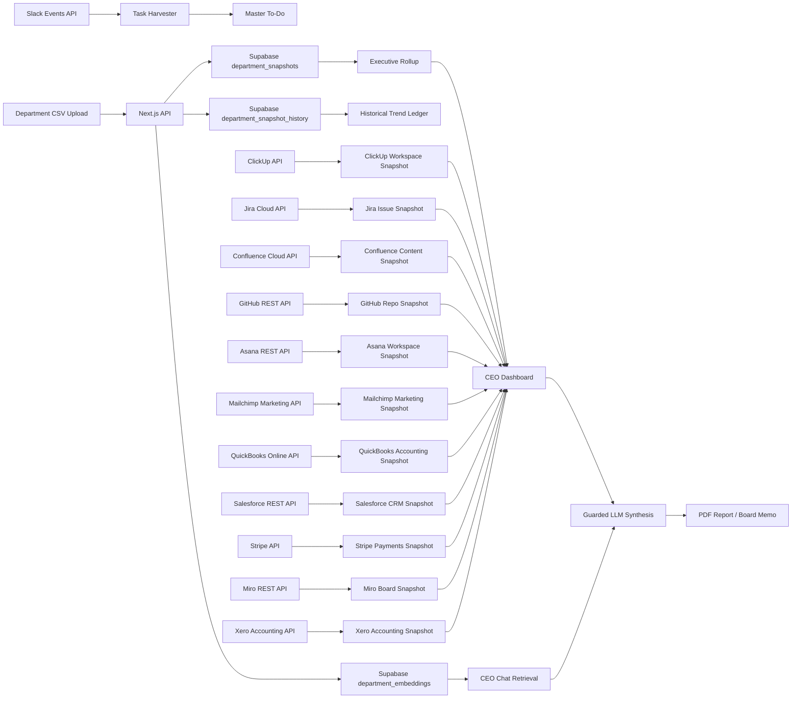

<div align="center">

# TAI Chief - AI Chief of Staff

### The open-source AI operating system for CEOs

Turn every department's metrics into board-ready decisions, Clerk-protected workspaces, Slack-aware action tracking, GitHub PR/bug intelligence, Miro board intelligence, Xero accounting visibility, ClickUp OKR/task/roadmap intelligence, executive scorecards, Supabase vector memory, CEO chat, a company digital twin, PDF reports, board memos, and guarded AI recommendations.

<br />

<a href="https://suhasbhairav.com">
  
</a>


<br />
<br />

**Created by [Suhas Bhairav](https://suhasbhairav.com)**  
Independent personal project. Completely open source under the MIT License.

<br />


</div>

---

## Why This Exists

TAI Chief is an operating intelligence workspace for CEOs, founders, operators, and functional leaders. It turns department-level CSV uploads into live dashboards, current Supabase JSONB snapshots, Slack-derived action items, historical trend imports, board memos, provider-neutral LLM recommendations, and forward-looking scenario simulations.

The product is designed around a simple idea: every important department should report the metrics a serious CEO would actually inspect, and the Executive dashboard should synthesize those signals into company-level operating judgment.

TAI Chief is also designed to move beyond summarizing the past. The Company Digital Twin lets leaders ask "what happens if..." questions and see the likely consequences across cash, revenue, GTM efficiency, hiring, margins, support, and engineering capacity.

---

## Product Cards

<table>
  <tr>
    <td width="33%" valign="top" bgcolor="#DBEAFE">
      <h3>Executive Command Center</h3>
      <p>
        
        
      </p>
      <p>CEO-level rollups across value creation, cash, GTM efficiency, customer/product health, risk, and execution posture.</p>
      <p><strong>Output:</strong> board-ready operating insight.</p>
    </td>
    <td width="33%" valign="top" bgcolor="#CFFAFE">
      <h3>Department Dashboards</h3>
      <p>
        
        
      </p>
      <p>Finance, Sales, Marketing, Product, HR, Legal, IT, Operations, Support, Risk, Strategy, R&D, and Executive views.</p>
      <p><strong>Output:</strong> KPI cards and 3-5 charts per function.</p>
    </td>
    <td width="33%" valign="top" bgcolor="#BBF7D0">
      <h3>AI Suggestions On Demand</h3>
      <p>
        
        
      </p>
      <p>LLM calls happen only when a user clicks <code>Fetch Suggestions</code> or <code>Fetch Org Suggestions</code>.</p>
      <p><strong>Output:</strong> concise action recommendations.</p>
    </td>
  </tr>
  <tr>
    <td width="33%" valign="top" bgcolor="#D9F99D">
      <h3>Supabase JSONB Store</h3>
      <p>
        
        
      </p>
      <p>Flexible department snapshots are stored as JSONB, so changing columns does not require schema churn.</p>
      <p><strong>Output:</strong> scalable operating data.</p>
    </td>
    <td width="33%" valign="top" bgcolor="#E9D5FF">
      <h3>Clerk Authentication</h3>
      <p>
        
        
      </p>
      <p>App-wide Clerk auth protects routes, provides sign-in/sign-up pages, and exposes account controls directly in the navbar.</p>
      <p><strong>Output:</strong> production-ready user access.</p>
    </td>
  </tr>
  <tr>
    <td width="33%" valign="top" bgcolor="#FBCFE8">
      <h3>Live Slack Workspace</h3>
      <p>
        
        
      </p>
      <p>Real Slack OAuth, Web API, Events API, signed request verification, task harvesting, and message snapshots.</p>
      <p><strong>Output:</strong> Robust company action tracking.</p>
    </td>
    <td width="33%" valign="top" bgcolor="#FED7AA">
      <h3>Enterprise Guardrails</h3>
      <p>
        
        
      </p>
      <p>All LLM calls are protected against prompt injection, jailbreaks, secret leakage, and unsafe task mutations.</p>
      <p><strong>Output:</strong> safer AI operations.</p>
    </td>
  </tr>
  <tr>
    <td width="33%" valign="top" bgcolor="#FFEDD5">
      <h3>HubSpot Deal Pipeline</h3>
      <p>
        
        
      </p>
      <p>Sync the full CRM deal pipeline for open pipeline, weighted forecast, stage mix, stale deals, top opportunities, and owner accountability.</p>
      <p><strong>Output:</strong> CEO revenue pipeline command center.</p>
    </td>
    <td width="33%" valign="top" bgcolor="#CCFBF1">
      <h3>CEO Chat Assistant</h3>
      <p>
        
        
      </p>
      <p>Chat about any department, retrieve Supabase vector evidence, and escalate to guarded LLM synthesis only when the CEO asks.</p>
      <p><strong>Output:</strong> grounded operating answers.</p>
    </td>
    <td width="33%" valign="top" bgcolor="#DCFCE7">
      <h3>Company Digital Twin</h3>
      <p>
        
        
      </p>
      <p>Simulate decisions like hiring salespeople, changing marketing spend, and adjusting prices across cash runway, ARR/MRR, CAC payback, pipeline, hiring cost, gross margin, support load, and engineering capacity.</p>
      <p><strong>Output:</strong> best, expected, and worst-case operating consequences.</p>
    </td>
  </tr>
  <tr>
    <td width="33%" valign="top" bgcolor="#EDE9FE">
      <h3>Linear Ticket Overview</h3>
      <p>
        
        
      </p>
      <p>Sync Linear issues for open load, urgent work, overdue tickets, stale execution, team pressure, project risk, and completion throughput.</p>
      <p><strong>Output:</strong> engineering execution command center.</p>
    </td>
  </tr>
  <tr>
    <td width="33%" valign="top" bgcolor="#F5D0FE">
      <h3>ClickUp Execution OS</h3>
      <p>
        
        
      </p>
      <p>Sync ClickUp Goals as OKRs, workspace tasks, roadmap-style initiatives, views, owners, stale work, overdue items, and CEO risk queue.</p>
      <p><strong>Output:</strong> execution visibility for ClickUp-run teams.</p>
    </td>
    <td width="33%" valign="top" bgcolor="#DBEAFE">
      <h3>Jira Delivery Command</h3>
      <p>
        
        
      </p>
      <p>Sync Jira issues and projects for delivery load, priority pressure, overdue work, stale execution, roadmap epics, and owner accountability.</p>
      <p><strong>Output:</strong> CEO software delivery command center.</p>
    </td>
    <td width="33%" valign="top" bgcolor="#CFFAFE">
      <h3>Confluence Knowledge OS</h3>
      <p>
        
        
      </p>
      <p>Sync pages and spaces for roadmap docs, policies, runbooks, owners, stale knowledge, and source-of-truth health.</p>
      <p><strong>Output:</strong> executive knowledge coverage map.</p>
    </td>
  </tr>
  <tr>
    <td width="33%" valign="top" bgcolor="#E0F2FE">
      <h3>Notion Product OKRs</h3>
      <p>
        
        
      </p>
      <p>Sync a real Notion OKR database into Product to track objectives, key results, owners, progress, status, risk, and due dates.</p>
      <p><strong>Output:</strong> live product execution scorecard.</p>
    </td>
    <td width="33%" valign="top" bgcolor="#DDD6FE">
      <h3>Historical Trend Imports</h3>
      <p>
        
        
      </p>
      <p>Every CSV upload is appended to an immutable Supabase import ledger for multi-period analysis.</p>
      <p><strong>Output:</strong> historical data trail.</p>
    </td>
  </tr>
  <tr>
    <td width="33%" valign="top" bgcolor="#BAE6FD">
      <h3>PDF Reports</h3>
      <p>
        
        
      </p>
      <p>Beautiful reports include cover pages, AI synthesis, KPI snapshots, chart tables, department tables, and methodology.</p>
      <p><strong>Output:</strong> polished management reports.</p>
    </td>
  </tr>
  <tr>
    <td width="33%" valign="top" bgcolor="#FECDD3">
      <h3>Board Memo Export</h3>
      <p>
        
        
      </p>
      <p>Generates board-facing PDFs and stores memo metadata/content in Supabase.</p>
      <p><strong>Output:</strong> investor-ready narrative.</p>
    </td>
  </tr>
</table>

---

## Core Capabilities

| Area | What It Does | Storage / Engine |
| --- | --- | --- |
| Executive dashboard | Summarizes all departments into CEO scorecards | Supabase JSONB |
| Department dashboards | Calculates KPI cards and charts from uploaded CSVs | Browser CSV parser + Supabase |
| Authentication | Protects app routes and exposes sign-in/sign-out controls | Clerk |
| AI synthesis | Generates CEO and department recommendations | Vercel AI SDK provider layer |
| CEO Chat | Retrieves department evidence and answers CEO questions | Supabase pgvector + configurable LLM |
| Company Digital Twin | Simulates best, expected, and worst-case operating consequences from editable assumptions | Browser model + Recharts |
| Product OKRs | Syncs live Notion OKRs into the Product dashboard | Notion API + Supabase |
| Deal Pipeline | Tracks HubSpot pipeline health for the CEO | HubSpot CRM API + Supabase |
| Ticket Overview | Tracks Linear execution health for the CEO | Linear npm SDK + Supabase |
| ClickUp Execution | Tracks ClickUp Goals, tasks, roadmap initiatives, views, owners, and risk | ClickUp API + Supabase |
| Jira Delivery | Tracks Jira projects, issues, priorities, owners, overdue work, stale work, and roadmap items | Jira Cloud REST API + Supabase |
| Confluence Knowledge | Tracks Confluence spaces, pages, roadmaps, policies, owners, and content freshness | Confluence Cloud REST API + Supabase |
| GitHub Engineering | Tracks repositories, pull requests, issues, bug queues, stale work, and engineering risk | GitHub REST API + Supabase |
| Miro Boards | Tracks collaboration boards, owners, sharing signals, freshness, and stale strategy artifacts | Miro REST API + Supabase summary JSON |
| Asana Work Management | Tracks projects, tasks, owners, overdue work, due-soon work, stale execution, and delivery risk | Asana REST API + Supabase |
| Mailchimp Marketing | Tracks audiences, campaigns, reports, open/click rates, unsubscribes, bounces, and email risk | Mailchimp Marketing API + Supabase |
| QuickBooks Accounting | Tracks chart of accounts, cash, A/R, A/P, income, expenses, reports, and finance risk | QuickBooks Online Accounting API + Supabase |
| Xero Accounting | Tracks organisations, accounts, contacts, invoices, bank transactions, receivables, payables, and finance risk | Xero Accounting API + Supabase summary JSON |
| Salesforce CRM | Tracks accounts, opportunities, leads, pipeline, forecast, owner load, and revenue risk | Salesforce REST API + Supabase |
| Stripe Payments | Tracks customers, payment intents, subscriptions, invoices, balances, MRR, failed payments, and billing risk | Stripe API + Supabase |
| Slack integration | Reads channels/DMs, replies, harvests commitments | Slack OAuth + Events API |
| Master To-Do | Tracks tasks, waiting-on items, delegated work | Supabase summary JSON |
| Historical imports | Preserves every upload for trend analysis | `department_snapshot_history` |
| PDF reports | Exports dashboard state and LLM explanation | `jspdf` + `jspdf-autotable` |
| Board memos | Saves and exports board-facing memo narratives | `board_memos` |
| Guardrails | Blocks jailbreaks and wraps untrusted data | Shared LLM guardrail layer |

---

## CEO Metrics Philosophy

This is not a generic BI dashboard. It focuses on the metrics CEOs, CFOs, operators, and investors actually care about:

<table>
  <tr>
    <td><strong>Growth Quality</strong><br />ARR, revenue growth, NRR, Rule of 40</td>
    <td><strong>Cash Discipline</strong><br />burn multiple, runway, FCF margin, operating expenses</td>
  </tr>
  <tr>
    <td><strong>GTM Efficiency</strong><br />pipeline, bookings, CAC, LTV:CAC, CAC payback, win rate</td>
    <td><strong>Product Health</strong><br />activation, retention, adoption, NPS, P1 bugs, velocity</td>
  </tr>
  <tr>
    <td><strong>Customer Health</strong><br />CSAT, NPS, backlog, escalation rate, response/resolution time</td>
    <td><strong>Operational Execution</strong><br />throughput, yield, defect rate, on-time delivery, inventory turns</td>
  </tr>
  <tr>
    <td><strong>Risk Posture</strong><br />enterprise risk, audit score, control coverage, unmitigated risks</td>
    <td><strong>Strategic Leverage</strong><br />TAM coverage, market share, partnerships, M&A pipeline</td>
  </tr>
</table>

The Executive dashboard intentionally avoids naive technical metrics like row count or column count as core charts. Those are relegated to the data-store table. Executive charts focus on operating outcomes.

---

## Architecture

```text
ai-chief-of-staff/
  ai-chief-of-staff/
    app/
      page.js                              # Home command center
      layout.js                            # ClerkProvider, navbar, sign-in/out controls
      sign-in/[[...sign-in...]]/page.js    # Clerk sign-in route
      sign-up/[[...sign-in...]]/page.js    # Clerk sign-up route
      departments/[slug]/page.js           # Department + executive dashboards
      slack/page.js                        # Live Slack workspace UI
      todo/page.js                         # Master To-Do command center
      integrations/page.js                 # Slack integration hub
      assistant/page.js                    # CEO chat over Supabase vector memory
      digital-twin/page.js                 # Company scenario simulator
      pipeline/page.js                     # HubSpot CEO deal pipeline
      tickets/page.js                      # Linear CEO ticket overview
      clickup/page.js                      # ClickUp OKR/task/roadmap overview
      jira/page.js                         # Jira CEO issue/project overview
      confluence/page.js                   # Confluence CEO knowledge overview
      github/page.js                       # GitHub CEO PR/bug/repository overview
      miro/page.js                         # Miro CEO board/workspace overview
      asana/page.js                        # Asana CEO work management overview
      mailchimp/page.js                    # Mailchimp CEO marketing overview
      quickbooks/page.js                   # QuickBooks CEO accounting overview
      xero/page.js                         # Xero CEO accounting overview
      salesforce/page.js                   # Salesforce CEO CRM overview
      stripe/page.js                       # Stripe CEO payments overview
      api/
        analytics/[department]/route.js    # Guarded LLM recommendations
        ceo-chat/route.js                  # Retrieval planner + CEO answer agent
        embeddings/rebuild/route.js        # Backfill vector memory
        notion/okrs/route.js               # Notion OKR sync and store
        hubspot/deals/route.js             # HubSpot deal pipeline sync and store
        linear/tickets/route.js            # Linear ticket sync and store
        clickup/overview/route.js          # ClickUp Goals, tasks, views sync and store
        jira/overview/route.js             # Jira issue/project sync and store
        confluence/overview/route.js       # Confluence page/space sync and store
        github/overview/route.js           # GitHub repository/PR/issue sync and store
        miro/boards/route.js               # Miro board sync and store
        asana/overview/route.js            # Asana project/task sync and store
        mailchimp/overview/route.js        # Mailchimp audience/campaign/report sync and store
        quickbooks/overview/route.js       # QuickBooks account/report sync and store
        xero/overview/route.js             # Xero accounting sync and store
        salesforce/overview/route.js       # Salesforce account/opportunity/lead sync and store
        stripe/overview/route.js           # Stripe payments/customer/subscription sync and store
        current-data/route.js              # Supabase JSONB current store
        historical-data/route.js           # Historical trend import ledger
        board-memos/route.js               # Board memo persistence
        slack/...                          # Slack OAuth, events, channels
        todo/route.js                      # Master To-Do sync and mutation
    lib/
      current-data-store.js                # Supabase read/write + org rollup
      llm/server.js                        # Provider-neutral LLM and embedding adapters
      llm/department-embeddings.js      # Configurable embeddings + pgvector retrieval
      llm/guardrails.js                 # Enterprise AI guardrails
      slack/server.js                      # Slack OAuth/API helpers
      supabase/server.js                   # Server-side Supabase client
    proxy.ts                               # Clerk route protection middleware

  supabase/
    schema.sql                             # Table creation SQL
    README.md                              # Supabase setup notes

  slack/
    slack-app-manifest.example.json        # Slack app manifest template
```

---

## Data Flow



1. A department user downloads a CSV template.
2. The user uploads operating data in that department dashboard.
3. The app parses the CSV in the browser into records.
4. `/api/current-data` upserts the current department snapshot.
5. The same upload is appended to the historical import ledger.
6. Executive rollups calculate org-level scorecards.
7. Uploads refresh Supabase vector embeddings for CEO chat retrieval.
8. LLM recommendations are generated only on explicit button clicks or chat sends.
9. PDF reports and board memos export from the live dashboard state.
10. The Digital Twin simulator models scenario consequences from editable operating assumptions.
11. Slack events and channel sync harvest commitments into the Master To-Do.
12. ClickUp sync stores Goals, tasks, views, roadmap items, and risk summaries for CEO review.
13. Jira sync stores issues, projects, delivery risks, and owner pressure for CEO review.
14. Confluence sync stores knowledge pages, spaces, freshness, and roadmap/policy coverage for CEO review.
15. GitHub sync stores repositories, PRs, issues, bugs, stale engineering work, and repo health for CEO review.
16. Miro sync stores boards, owners, sharing signals, freshness, and stale strategy artifacts for CEO review.
17. Asana sync stores projects, tasks, owners, overdue work, stale work, and execution risk for CEO review.
18. Mailchimp sync stores audiences, campaigns, reports, engagement, unsubscribes, bounces, and marketing risk for CEO review.
19. QuickBooks sync stores accounts, P&L, balance sheet, cash flow, receivables, payables, and accounting risk for CEO review.
20. Xero sync stores organisations, accounts, contacts, invoices, bank transactions, receivables, payables, and finance risk for CEO review.
21. Salesforce sync stores accounts, opportunities, leads, pipeline, forecast, stale deals, and revenue risk for CEO review.
22. Stripe sync stores customers, payment intents, subscriptions, invoices, balances, MRR, failed payments, overdue invoices, and billing risk for CEO review.

---

## Supabase Data Model

Primary tables:

| Table | Purpose |
| --- | --- |
| `department_snapshots` | One current JSONB snapshot per department |
| `organization_summaries` | Latest executive rollup and summary content |
| `department_snapshot_history` | Immutable historical import ledger |
| `board_memos` | Saved board memo metadata and JSON content |
| `department_embeddings` | pgvector chunks for CEO chat and department retrieval |
| `notion_okr_snapshots` | Synced Notion Product OKR snapshots |
| `hubspot_deal_snapshots` | Synced HubSpot deal pipeline snapshots |
| `linear_ticket_snapshots` | Synced Linear issue snapshots |
| `clickup_workspace_snapshots` | Synced ClickUp Goals, tasks, roadmap items, views, and summaries |
| `jira_issue_snapshots` | Synced Jira issues, projects, delivery risks, and summaries |
| `confluence_content_snapshots` | Synced Confluence pages, spaces, content freshness, and summaries |
| `github_repo_snapshots` | Synced GitHub repositories, pull requests, issues, bugs, and summaries |
| `asana_workspace_snapshots` | Synced Asana projects, tasks, owners, overdue work, stale work, and summaries |
| `mailchimp_marketing_snapshots` | Synced Mailchimp audiences, campaigns, reports, engagement, unsubscribes, bounces, and summaries |
| `quickbooks_accounting_snapshots` | Synced QuickBooks chart of accounts, reports, balances, receivables, payables, and summaries |
| `salesforce_crm_snapshots` | Synced Salesforce accounts, opportunities, leads, pipeline, forecast, owner load, and summaries |
| `stripe_payments_snapshots` | Synced Stripe customers, payments, subscriptions, invoices, balances, MRR, and billing risk summaries |
| `slack_installations` | Active Slack workspace installs and bot tokens |
| `slack_events` | Signed Slack Events API webhook ledger |
| `slack_message_snapshots` | Slack channel/DM message snapshots |

Run [supabase/schema.sql](supabase/schema.sql) in the Supabase SQL Editor before starting the app.
The schema enables `pgvector` and exposes `match_department_embeddings` for cosine-similarity search.

For a full demo workspace, run [supabase/seed-demo.sql](supabase/seed-demo.sql) after the schema. It resets TAI Chief application tables and loads two quarters of demo data from April 2026 through September 2026 across departments, integrations, GitHub engineering queues, Asana work queues, Mailchimp campaigns, QuickBooks accounting, Salesforce CRM, Stripe payments, board memos, historical imports, and vector search.

---

## Clerk Authentication

TAI Chief uses Clerk for application authentication.

- `ClerkProvider` wraps the app in [ai-chief-of-staff/app/layout.js](ai-chief-of-staff/app/layout.js).
- Navbar auth controls show `Sign In` and `Sign Up` for signed-out users.
- Signed-in users see the Clerk account button and a `Sign Out` button in the navbar.
- [ai-chief-of-staff/proxy.ts](ai-chief-of-staff/proxy.ts) protects every app/API route except `/sign-in` and `/sign-up`.
- Clerk pages live at `/sign-in` and `/sign-up`.

Required Clerk environment variables:

```bash
NEXT_PUBLIC_CLERK_PUBLISHABLE_KEY=your_clerk_publishable_key
CLERK_SECRET_KEY=your_clerk_secret_key
```

---

## Enterprise AI Guardrails

All LLM calls use [ai-chief-of-staff/lib/llm/guardrails.js](ai-chief-of-staff/lib/llm/guardrails.js) before reaching [ai-chief-of-staff/lib/llm/server.js](ai-chief-of-staff/lib/llm/server.js).

The LLM gateway is implemented with Vercel AI SDK (`ai`) and provider adapters for OpenAI, Anthropic, Google Gemini, plus OpenAI-compatible enterprise gateways.

<table>
  <tr>
    <td><strong>Prompt Injection Defense</strong><br />Blocks direct jailbreak and secret-exfiltration prompts before model calls.</td>
    <td><strong>Secret Redaction</strong><br />Redacts common API key, Slack token, JWT, password, and service-role patterns.</td>
  </tr>
  <tr>
    <td><strong>Untrusted Data Wrapping</strong><br />Slack messages, CSV-derived JSON, tasks, and dashboards are marked as evidence, not instructions.</td>
    <td><strong>Payload Caps</strong><br />Normalizes and truncates oversized inputs before LLM calls.</td>
  </tr>
  <tr>
    <td><strong>Guarded LLM Gateway</strong><br />All model calls go through <code>guardedResponsesCreate</code>.</td>
    <td><strong>Action Validation</strong><br />Task resolve/delegate/add actions are validated before mutation.</td>
  </tr>
</table>

If a direct request resembles a jailbreak or credential-exfiltration attempt, the API blocks it before it reaches the configured LLM provider.

---

## Slack Integration

This is a real Slack integration, not a simulator.

<table>
  <tr>
    <td><strong>OAuth</strong><br /><code>/api/integrations/slack/authorize</code> and callback token exchange.</td>
    <td><strong>Events API</strong><br />Signed request verification at <code>/api/slack/events</code>.</td>
  </tr>
  <tr>
    <td><strong>Web API</strong><br /><code>conversations.list</code>, <code>conversations.history</code>, <code>chat.postMessage</code>.</td>
    <td><strong>Task Harvesting</strong><br />Slack messages are analyzed and converted into Master To-Do items.</td>
  </tr>
</table>

Create a Slack app using [slack/slack-app-manifest.example.json](slack/slack-app-manifest.example.json), replacing `YOUR_APP_DOMAIN.com` with your deployed app domain.

Required Slack URLs:

```text
Redirect URL: https://your-app-domain.com/api/integrations/slack/callback
Events URL:   https://your-app-domain.com/api/slack/events
```

Required bot scopes:

```text
app_mentions:read
channels:history
channels:join
channels:read
chat:write
chat:write.public
groups:history
groups:read
im:history
im:read
im:write
mpim:history
mpim:read
team:read
users:read
```

Required bot events:

```text
app_mention
message.channels
message.groups
message.im
message.mpim
```

After install, open `/integrations` and connect Slack. Then use `/slack` for the live workspace view, `/todo` to sync harvested commitments, and Slack DMs/app mentions to talk to Aegis from inside Slack.

---

## Notion Product OKRs

This is a real Notion integration for Product OKR tracking.

1. Create a Notion internal integration.
2. Copy the integration secret.
3. Share your Product OKR database with that integration.
4. Copy the database ID from the Notion database URL.
5. Add the values in Vercel env vars or connect manually from `/integrations`.
6. Open `/departments/product` and click `Sync Notion OKRs`.

Recommended database properties:

```text
Objective
Key Result
Owner
Status
Progress
Quarter
Due Date
Department
Priority
Confidence
```

The parser is flexible and also recognizes common variants like `Name`, `KR`, `DRI`, `State`, `% Complete`, `Cycle`, and `Target Date`.

---

## HubSpot Deal Pipeline

This is a real HubSpot CRM integration for CEO-level deal pipeline tracking.

1. Create a HubSpot Private App.
2. Add CRM read scopes for deals, pipelines, and owners.
3. Copy the Private App access token.
4. Add it in Vercel env vars or connect manually from `/integrations`.
5. Open `/pipeline` and click `Sync HubSpot Deals`.

The pipeline dashboard tracks open pipeline, weighted forecast, next 90-day forecast, stale deals, open deal count, average deal size, pipeline by stage, pipeline by HubSpot pipeline, and top open deals.

---

## Linear Ticket Overview

This is a real Linear integration using Linear&apos;s official npm SDK.

1. Create a Linear personal API key from Linear account security settings.
2. Add it in Vercel env vars or connect manually from `/integrations`.
3. Open `/tickets` and click `Sync Linear Tickets`.

The ticket overview tracks open tickets, urgent issues, overdue work, stale execution, completed issues in the last 30 days, average open age, team load, priority mix, and CEO risk queue.

---

## ClickUp Execution Overview

This is a real ClickUp integration for companies that run OKRs, delivery, and roadmap work in ClickUp.

1. For production OAuth, create a ClickUp OAuth app and set the redirect URL to `https://your-app-domain.com/api/integrations/clickup/callback`.
2. Add `CLICKUP_CLIENT_ID` and `CLICKUP_CLIENT_SECRET` in Vercel.
3. For a single internal workspace, you can also add `CLICKUP_API_TOKEN` with a ClickUp personal token that starts with `pk_`.
4. Optionally add `CLICKUP_WORKSPACE_ID` to pin one workspace when a token can access multiple workspaces.
5. Open `/integrations` and connect ClickUp through OAuth or a personal token.
6. Open `/clickup` and click `Sync ClickUp`.

The ClickUp overview syncs authorized workspaces, Goals as OKRs, workspace tasks, workspace-level views, and roadmap-style work inferred from initiatives, milestones, releases, epics, launches, OKRs, and goals. It stores each sync in `clickup_workspace_snapshots` and surfaces CEO metrics for goal progress, overdue work, stale execution, owner load, roadmap status, and top risks.

---

## Jira And Confluence

This is a real Atlassian Cloud integration for teams that run execution in Jira and operating knowledge in Confluence.

1. Create an Atlassian API token from your Atlassian account security settings.
2. Use your Atlassian site URL, for example `https://your-company.atlassian.net`.
3. Add shared env vars in Vercel, or connect Jira and Confluence manually from `/integrations`.
4. Optional: set `JIRA_JQL` to restrict the Jira issue sync.
5. Optional: set `CONFLUENCE_CQL` to restrict the Confluence page sync.
6. Open `/jira` and click `Sync Jira`.
7. Open `/confluence` and click `Sync Confluence`.

Shared Atlassian env vars:

```bash
ATLASSIAN_SITE_URL=https://your-company.atlassian.net
ATLASSIAN_EMAIL=you@company.com
ATLASSIAN_API_TOKEN=your_atlassian_api_token
```

Jira-specific override env vars:

```bash
JIRA_SITE_URL=https://your-company.atlassian.net
JIRA_EMAIL=you@company.com
JIRA_API_TOKEN=your_atlassian_api_token
JIRA_JQL=order by updated DESC
```

Confluence-specific override env vars:

```bash
CONFLUENCE_SITE_URL=https://your-company.atlassian.net
CONFLUENCE_EMAIL=you@company.com
CONFLUENCE_API_TOKEN=your_atlassian_api_token
CONFLUENCE_CQL=type=page order by lastmodified desc
```

The Jira overview stores syncs in `jira_issue_snapshots` and tracks open issues, priority pressure, overdue work, stale work, completed issues, roadmap items, status mix, project load, assignee load, and CEO risk queue.

The Confluence overview stores syncs in `confluence_content_snapshots` and tracks pages, spaces, recent updates, stale knowledge, roadmap pages, policy/runbook coverage, owner distribution, and executive source-of-truth health.

---

## GitHub Engineering

This is a real GitHub REST API integration for teams that want CEO visibility into engineering flow.

1. Create a fine-grained personal access token or GitHub App token.
2. Grant read access for repository metadata, pull requests, and issues.
3. Add env vars in Vercel, or connect GitHub manually from `/integrations`.
4. Optional: set `GITHUB_OWNER` to a user or organization.
5. Optional: set `GITHUB_REPOS` to comma-separated repo names or full names.
6. Open `/github` and click `Sync GitHub`.

```bash
GITHUB_TOKEN=your_github_token
GITHUB_OWNER=your_org_or_user_optional
GITHUB_REPOS=repo_one,repo_two_optional
```

The GitHub overview stores syncs in `github_repo_snapshots` and tracks repository coverage, open PRs, draft PRs, stale PRs, open bugs, stale issues, repo concentration, language mix, review queue, bug queue, and CEO engineering risk queue.

---

## Asana Work Management

This is a real Asana REST API integration for teams that run work management, cross-functional initiatives, launch plans, and operating cadences in Asana.

1. Create an Asana personal access token or OAuth token.
2. Grant access to the workspaces, projects, and tasks TAI Chief should read.
3. Add env vars in Vercel, or connect Asana manually from `/integrations`.
4. Optional: set `ASANA_WORKSPACE_GID` to choose a workspace.
5. Optional: set `ASANA_PROJECT_GIDS` to comma-separated project GIDs.
6. Open `/asana` and click `Sync Asana`.

```bash
ASANA_ACCESS_TOKEN=your_asana_personal_access_token
ASANA_WORKSPACE_GID=your_workspace_gid_optional
ASANA_PROJECT_GIDS=project_gid_one,project_gid_two_optional
```

The Asana overview stores syncs in `asana_workspace_snapshots` and tracks projects, open tasks, completed tasks, overdue work, due-soon work, stale tasks, owner gaps, project load, owner load, and CEO execution risk queue.

---

## Mailchimp Marketing

This is a real Mailchimp Marketing API integration for teams that run owned-audience growth, newsletters, product launches, and customer lifecycle campaigns in Mailchimp.

1. Create a Mailchimp Marketing API key from account API keys.
2. Use the server prefix from the API key suffix, for example `us21`.
3. Add env vars in Vercel, or connect Mailchimp manually from `/integrations`.
4. Open `/mailchimp` and click `Sync Mailchimp`.

```bash
MAILCHIMP_API_KEY=your_mailchimp_api_key
MAILCHIMP_SERVER_PREFIX=us21
```

The Mailchimp overview stores syncs in `mailchimp_marketing_snapshots` and tracks audience size, unsubscribes, cleaned contacts, campaign status mix, open rate, click rate, emails sent, bounces, recent reports, and CEO marketing risk queue.

---

## QuickBooks Accounting

This is a real QuickBooks Online Accounting API integration for CEOs who want accounting truth next to operating metrics.

1. Create an Intuit Developer app and connect it to a QuickBooks Online company.
2. Capture the OAuth `realmId`, which is the QuickBooks company ID.
3. Add either a short-lived access token, or a refresh token with client ID and client secret.
4. Set `QUICKBOOKS_ENVIRONMENT` to `sandbox` or `production`.
5. Open `/quickbooks` and click `Sync QuickBooks`.

```bash
QUICKBOOKS_REALM_ID=your_quickbooks_company_id
QUICKBOOKS_ENVIRONMENT=sandbox
QUICKBOOKS_ACCESS_TOKEN=your_oauth_access_token
QUICKBOOKS_CLIENT_ID=your_intuit_client_id_optional
QUICKBOOKS_CLIENT_SECRET=your_intuit_client_secret_optional
QUICKBOOKS_REFRESH_TOKEN=your_oauth_refresh_token_optional
```

The QuickBooks overview stores syncs in `quickbooks_accounting_snapshots` and tracks chart of accounts, bank cash, A/R, A/P, income, expenses, assets, liabilities, equity, P&L, balance sheet, cash flow, largest accounts, and CEO finance risk queue.

---

## Xero Accounting

This is a real Xero Accounting API integration for CEOs who want receivables, payables, invoices, contacts, bank transactions, and finance risk beside operating metrics.

1. Create a Xero OAuth 2.0 app.
2. Configure OAuth with this redirect URL: `https://your-app-domain.com/api/integrations/xero/callback`.
3. Grant read scopes for accounting settings, contacts, and transactions.
4. Add OAuth credentials in Vercel, or connect Xero manually from `/integrations`.
5. Open `/xero` and click `Sync Xero`.

```bash
XERO_CLIENT_ID=your_xero_client_id
XERO_CLIENT_SECRET=your_xero_client_secret
XERO_ACCESS_TOKEN=optional_oauth_access_token
XERO_REFRESH_TOKEN=optional_oauth_refresh_token
XERO_TENANT_ID=optional_xero_tenant_id
```

The Xero overview stores syncs in local `xero-accounting.json` or Supabase organization summary JSON and tracks organisations, accounts, contacts, customers, suppliers, invoices, overdue invoices, receivables, payables, bank transaction volume, account mix, and CEO finance risk queue.

---

## Salesforce CRM

This is a real Salesforce REST API integration for CEOs who need revenue truth beside finance and operating metrics.

1. Create a Salesforce connected app with REST API access.
2. Obtain an OAuth access token for the target Salesforce org.
3. Set the instance URL, for example `https://your-domain.my.salesforce.com`.
4. Open `/salesforce` and click `Sync Salesforce`.

```bash
SALESFORCE_INSTANCE_URL=https://your-domain.my.salesforce.com
SALESFORCE_ACCESS_TOKEN=your_salesforce_oauth_access_token
SALESFORCE_API_VERSION=v61.0
```

The Salesforce overview stores syncs in `salesforce_crm_snapshots` and tracks accounts, opportunities, leads, open pipeline, weighted pipeline, current-quarter forecast, closed-won amount, stale opportunities, overdue close dates, stage mix, owner load, lead source mix, and CEO revenue risk queue.

---

## Stripe Payments

This is a real Stripe API integration for CEOs who need payment, subscription, invoice, and cash visibility beside CRM and accounting.

1. Create a Stripe restricted key or use a server-side secret key.
2. Grant read access for account, customers, payment intents, subscriptions, invoices, and balance.
3. Add the key in Vercel as `STRIPE_SECRET_KEY`, or connect Stripe manually from `/integrations`.
4. Open `/stripe` and click `Sync Stripe`.

```bash
STRIPE_SECRET_KEY=sk_live_or_rk_live_key
```

The Stripe overview stores syncs in `stripe_payments_snapshots` and tracks customer count, delinquent customers, payment volume, failed payments, MRR, subscriptions, open invoices, overdue invoices, Stripe balance, revenue by currency, and CEO billing risk queue.

---

## Miro Boards

This is a real Miro REST API integration for CEOs who need collaboration and strategy-board visibility beside engineering, docs, and operating metrics.

1. Create a Miro developer app.
2. Configure OAuth with this redirect URL: `https://your-app-domain.com/api/integrations/miro/callback`.
3. Grant at least `boards:read` access for board discovery.
4. Add OAuth credentials in Vercel, or connect Miro manually from `/integrations`.
5. Open `/miro` and click `Sync Miro Boards`.

```bash
MIRO_CLIENT_ID=your_miro_client_id
MIRO_CLIENT_SECRET=your_miro_client_secret
MIRO_ACCESS_TOKEN=optional_server_side_access_token
```

The Miro overview stores syncs in local `miro-boards.json` or Supabase organization summary JSON and tracks total boards, recently updated boards, stale boards, owner concentration, broad-sharing signals, recent collaboration boards, and stale strategy artifacts.

---

## Reports And Board Memos

<table>
  <tr>
    <td width="50%">
      <h3>PDF Reports</h3>
      <ul>
        <li>Designed cover page</li>
        <li>Provider-neutral LLM synthesis</li>
        <li>KPI cards</li>
        <li>Chart source tables</li>
        <li>Department data tables</li>
        <li>Historical imports</li>
        <li>Methodology</li>
      </ul>
    </td>
    <td width="50%">
      <h3>Board Memo Export</h3>
      <ul>
        <li>Board-facing narrative</li>
        <li>CEO recommendations</li>
        <li>Risk summary</li>
        <li>Operating actions</li>
        <li>Saved metadata in Supabase</li>
      </ul>
    </td>
  </tr>
</table>

For the best report, upload department CSVs first and click `Fetch Suggestions` before exporting.

---

## Environment Variables

Create `ai-chief-of-staff/.env.local` or configure the same variables in Vercel:

```bash
LLM_PROVIDER=openai
LLM_MODEL=gpt-5.5
LLM_API_KEY=your_llm_api_key_here
LLM_BASE_URL=
EMBEDDING_PROVIDER=openai
EMBEDDING_MODEL=text-embedding-3-small
EMBEDDING_API_KEY=
EMBEDDING_BASE_URL=
NEXT_PUBLIC_SUPABASE_URL=https://your-project.supabase.co
SUPABASE_SERVICE_ROLE_KEY=your_supabase_service_role_or_secret_key
NEXT_PUBLIC_APP_URL=https://your-app-domain.com
SLACK_CLIENT_ID=your_slack_client_id
SLACK_CLIENT_SECRET=your_slack_client_secret
SLACK_SIGNING_SECRET=your_slack_signing_secret
NOTION_API_KEY=your_notion_internal_integration_secret
NOTION_OKR_DATABASE_ID=your_product_okr_database_id
HUBSPOT_ACCESS_TOKEN=your_hubspot_private_app_access_token
LINEAR_API_KEY=your_linear_personal_api_key
CLICKUP_API_TOKEN=your_clickup_personal_token_optional
CLICKUP_WORKSPACE_ID=your_clickup_workspace_id_optional
CLICKUP_CLIENT_ID=your_clickup_oauth_client_id_optional
CLICKUP_CLIENT_SECRET=your_clickup_oauth_client_secret_optional
ATLASSIAN_SITE_URL=https://your-company.atlassian.net
ATLASSIAN_EMAIL=you@company.com
ATLASSIAN_API_TOKEN=your_atlassian_api_token
JIRA_JQL=order by updated DESC
CONFLUENCE_CQL=type=page order by lastmodified desc
GITHUB_TOKEN=your_github_token
GITHUB_OWNER=your_org_or_user_optional
GITHUB_REPOS=repo_one,repo_two_optional
ASANA_ACCESS_TOKEN=your_asana_personal_access_token
ASANA_WORKSPACE_GID=your_workspace_gid_optional
ASANA_PROJECT_GIDS=project_gid_one,project_gid_two_optional
MAILCHIMP_API_KEY=your_mailchimp_api_key
MAILCHIMP_SERVER_PREFIX=us21
QUICKBOOKS_REALM_ID=your_quickbooks_company_id
QUICKBOOKS_ENVIRONMENT=sandbox
QUICKBOOKS_ACCESS_TOKEN=your_oauth_access_token
QUICKBOOKS_CLIENT_ID=your_intuit_client_id_optional
QUICKBOOKS_CLIENT_SECRET=your_intuit_client_secret_optional
QUICKBOOKS_REFRESH_TOKEN=your_oauth_refresh_token_optional
SALESFORCE_INSTANCE_URL=https://your-domain.my.salesforce.com
SALESFORCE_ACCESS_TOKEN=your_salesforce_oauth_access_token
SALESFORCE_API_VERSION=v61.0
STRIPE_SECRET_KEY=your_stripe_secret_or_restricted_key
NEXT_PUBLIC_CLERK_PUBLISHABLE_KEY=your_clerk_publishable_key
CLERK_SECRET_KEY=your_clerk_secret_key
```

LLM provider options:

- `LLM_PROVIDER=openai`: uses OpenAI Responses API.
- `LLM_PROVIDER=openai-compatible`: uses `LLM_BASE_URL` with `/chat/completions`, suitable for OpenRouter, Together, Groq, vLLM, LiteLLM, and enterprise gateways.
- `LLM_PROVIDER=anthropic`: uses Anthropic Messages API.
- `LLM_PROVIDER=gemini`: uses Google Gemini Generate Content API.

Embeddings are configured separately because pgvector dimensions must match the database schema. The included Supabase schema uses `vector(1536)`, which matches `text-embedding-3-small`.

Do not commit real `.env` files. They are ignored by `.gitignore`.

---

## Quick Start

```bash
cd ai-chief-of-staff
npm install
npm run dev
```

Open:

```text
http://localhost:3000
```

Production check:

```bash
cd ai-chief-of-staff
npm run lint
npm run build
```

---

## Department Metrics

<table>
  <tr>
    <td><strong>Finance</strong><br />ARR, revenue growth, margin, FCF, cash, runway, burn multiple</td>
    <td><strong>Sales</strong><br />pipeline, bookings, ARR won, win rate, quota, churn-risk ARR</td>
  </tr>
  <tr>
    <td><strong>Marketing</strong><br />spend, MQL, SQL, CAC, LTV, CAC payback, ROAS</td>
    <td><strong>Product</strong><br />active users, activation, retention, NPS, velocity, P1 bugs</td>
  </tr>
  <tr>
    <td><strong>Operations</strong><br />throughput, demand, delivery, inventory, defects, unit cost</td>
    <td><strong>HR</strong><br />headcount, attrition, eNPS, revenue per employee, time to hire</td>
  </tr>
  <tr>
    <td><strong>Support</strong><br />tickets, first response, resolution time, CSAT, NPS, backlog</td>
    <td><strong>Risk</strong><br />risk score, controls, audit score, mitigations, security findings</td>
  </tr>
  <tr>
    <td><strong>Strategy</strong><br />TAM coverage, market share, partnerships, competitive win rate</td>
    <td><strong>Legal / IT / R&D</strong><br />contracts, compliance, uptime, cloud spend, IP, experiments</td>
  </tr>
</table>

---

## Executive Dashboard

The Executive dashboard rolls up Supabase department JSON into four CEO scorecards:

| Scorecard | Metrics |
| --- | --- |
| Value Creation and Cash | Rule of 40, NRR, gross margin, runway |
| GTM Efficiency | qualified pipeline, bookings, CAC payback, win rate |
| Customer and Product Health | 30-day retention, NPS, CSAT, activation |
| Risk and Execution Posture | enterprise risk, audit score, on-time delivery, security incidents |

The Executive page also includes a metrics glossary so operators can understand what each metric means and how it should be interpreted.

---

## Company Digital Twin

The `/digital-twin` workspace is a forward-looking scenario simulator for CEO decisions. Instead of only summarizing historical performance, it models how operating choices influence one another over the next 12 months.

Example CEO question:

> What happens if we hire five salespeople, increase marketing spend by 20%, and reduce prices by 10%?

The simulator returns best, expected, and worst-case outcomes for:

- Cash runway
- ARR and MRR
- CAC payback
- Pipeline requirements
- Hiring costs
- Gross margin
- Support workload
- Engineering capacity

Every assumption is visible and editable, including starting cash, current MRR, customer count, gross margin, monthly burn, marketing spend, baseline new MRR, CAC, win rate, sales cycle, sales quota, ramp time, churn, support capacity, engineering capacity, roadmap demand, price elasticity, and margin sensitivity.

---

## Recommended CEO Workflow

1. Start at the home command center.
2. Visit each department dashboard.
3. Download the department CSV template.
4. Fill it with monthly operating data.
5. Upload the CSV.
6. Confirm charts and KPI cards update.
7. Return to Executive.
8. Review the combined scorecards.
9. Click `Fetch Org Suggestions`.
10. Open `/assistant` to ask CEO-level questions grounded in Supabase vector memory.
11. Open `/digital-twin` to simulate future operating decisions before committing to them.
12. Open `/pipeline` to sync and inspect the HubSpot deal pipeline.
13. Open `/tickets` to sync and inspect Linear execution health.
14. Open `/clickup` to sync and inspect ClickUp OKRs, tasks, and roadmap risks.
15. Open `/jira` to sync and inspect Jira delivery risks.
16. Open `/confluence` to sync and inspect Confluence knowledge health.
17. Open `/github` to sync and inspect GitHub PRs, bugs, stale issues, and repo health.
18. Open `/miro` to sync and inspect collaboration boards, stale strategy artifacts, owners, and sharing signals.
19. Open `/asana` to sync and inspect Asana projects, tasks, owner gaps, and execution risks.
20. Open `/mailchimp` to sync and inspect audience health, campaign engagement, unsubscribes, bounces, and email risk.
21. Open `/quickbooks` to sync and inspect accounting balances, receivables, payables, and finance risk.
22. Open `/xero` to sync and inspect receivables, payables, invoices, contacts, bank transactions, and finance risk.
23. Open `/salesforce` to sync and inspect CRM pipeline, forecast, leads, stale deals, and revenue risk.
24. Export a PDF report or board memo.
25. Use `/todo` and `/slack` to track commitments and follow-ups.

---

## Routes

```text
/                               Home command center
/departments/executive           Executive dashboard
/departments/finance             Finance dashboard
/departments/sales               Sales dashboard
/integrations                    Tool integrations hub
/slack                           Live Slack workspace
/todo                            Master To-Do
/assistant                       CEO chat over Supabase vector memory
/digital-twin                    Company digital twin and scenario simulator
/pipeline                        HubSpot CEO deal pipeline
/tickets                         Linear CEO ticket overview
/clickup                         ClickUp CEO OKR/task/roadmap overview
/jira                            Jira CEO issue/project overview
/confluence                      Confluence CEO knowledge overview
/github                          GitHub CEO PR/bug/repository overview
/miro                            Miro CEO board/workspace overview
/asana                           Asana CEO work management overview
/mailchimp                       Mailchimp CEO marketing overview
/quickbooks                      QuickBooks CEO accounting overview
/xero                            Xero CEO accounting overview
/salesforce                      Salesforce CEO CRM overview
/stripe                          Stripe CEO payments overview
/sign-in                         Clerk sign-in
/sign-up                         Clerk sign-up
/api/current-data                 Supabase JSONB store
/api/historical-data              Supabase historical import ledger
/api/board-memos                  Supabase board memo storage
/api/analytics/[department]       Guarded LLM analysis endpoint
/api/ceo-chat                    Retrieval planner and CEO answer agent
/api/embeddings/rebuild          Supabase vector memory backfill
/api/notion/okrs                 Notion Product OKR sync endpoint
/api/hubspot/deals               HubSpot deal pipeline sync endpoint
/api/linear/tickets              Linear ticket overview sync endpoint
/api/clickup/overview            ClickUp OKR/task/roadmap sync endpoint
/api/jira/overview               Jira issue/project sync endpoint
/api/confluence/overview         Confluence page/space sync endpoint
/api/github/overview             GitHub repository/PR/issue sync endpoint
/api/miro/boards                 Miro board sync endpoint
/api/asana/overview              Asana project/task sync endpoint
/api/mailchimp/overview          Mailchimp audience/campaign/report sync endpoint
/api/quickbooks/overview         QuickBooks account/report sync endpoint
/api/xero/overview               Xero accounting sync endpoint
/api/salesforce/overview         Salesforce account/opportunity/lead sync endpoint
/api/stripe/overview             Stripe payments/customer/subscription sync endpoint
/api/integrations/clickup/authorize ClickUp OAuth start
/api/integrations/clickup/callback  ClickUp OAuth callback
/api/integrations/miro/authorize Miro OAuth start
/api/integrations/miro/callback  Miro OAuth callback
/api/integrations/xero/authorize Xero OAuth start
/api/integrations/xero/callback  Xero OAuth callback
/api/integrations/slack/authorize Slack OAuth start
/api/integrations/slack/callback  Slack OAuth callback
/api/slack/events                 Slack Events API endpoint
/api/slack/channels               Slack conversations.list endpoint
```

---

## Roadmap

- Role-based access control and organization-level permissions
- Department schema validation
- Automated anomaly detection before LLM synthesis
- Slack/email action routing to department owners
- Permissioned multi-company workspaces
- Audit log viewer for Slack events, LLM calls, and board memo generation

---

## Status

This is a completely open-source, local-first MVP of an AI operating system for company leadership. It is an independent personal project designed to be credible in front of founders, operators, investors, and technical reviewers, while remaining small enough to iterate quickly.

---

## License

MIT License. See [LICENSE](LICENSE).
