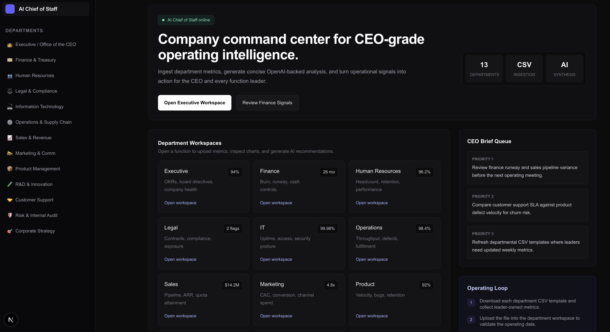
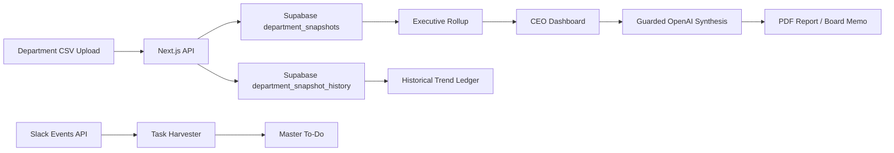

<div align="center">

# AI Chief of Staff

### The open-source AI operating system for CEOs

Turn every department's metrics into board-ready decisions, Slack-aware action tracking, executive scorecards, PDF reports, board memos, and guarded AI recommendations.

<br />

<a href="https://suhasbhairav.com">
  
</a>


<br />
<br />

**Created by [Suhas Bhairav](https://suhasbhairav.com)**  
Independent personal project. Completely open source under the MIT License.

<br />



</div>

---

## Why This Exists

AI Chief of Staff is an operating intelligence workspace for CEOs, founders, operators, and functional leaders. It turns department-level CSV uploads into live dashboards, current Supabase JSONB snapshots, Slack-derived action items, historical trend imports, board memos, and OpenAI-generated recommendations.

The product is designed around a simple idea: every important department should report the metrics a serious CEO would actually inspect, and the Executive dashboard should synthesize those signals into company-level operating judgment.

---

## Product Cards

<table>
  <tr>
    <td width="33%" valign="top" bgcolor="#DBEAFE">
      <h3>Executive Command Center</h3>
      <p>
        
        
      </p>
      <p>CEO-level rollups across value creation, cash, GTM efficiency, customer/product health, risk, and execution posture.</p>
      <p><strong>Output:</strong> board-ready operating insight.</p>
    </td>
    <td width="33%" valign="top" bgcolor="#CFFAFE">
      <h3>Department Dashboards</h3>
      <p>
        
        
      </p>
      <p>Finance, Sales, Marketing, Product, HR, Legal, IT, Operations, Support, Risk, Strategy, R&D, and Executive views.</p>
      <p><strong>Output:</strong> KPI cards and 3-5 charts per function.</p>
    </td>
    <td width="33%" valign="top" bgcolor="#BBF7D0">
      <h3>AI Suggestions On Demand</h3>
      <p>
        
        
      </p>
      <p>OpenAI calls happen only when a user clicks <code>Fetch Suggestions</code> or <code>Fetch Org Suggestions</code>.</p>
      <p><strong>Output:</strong> concise action recommendations.</p>
    </td>
  </tr>
  <tr>
    <td width="33%" valign="top" bgcolor="#D9F99D">
      <h3>Supabase JSONB Store</h3>
      <p>
        
        
      </p>
      <p>Flexible department snapshots are stored as JSONB, so changing columns does not require schema churn.</p>
      <p><strong>Output:</strong> scalable operating data.</p>
    </td>
    <td width="33%" valign="top" bgcolor="#FBCFE8">
      <h3>Live Slack Workspace</h3>
      <p>
        
        
      </p>
      <p>Real Slack OAuth, Web API, Events API, signed request verification, task harvesting, and message snapshots.</p>
      <p><strong>Output:</strong> Bond-style company action tracking.</p>
    </td>
    <td width="33%" valign="top" bgcolor="#FED7AA">
      <h3>Enterprise Guardrails</h3>
      <p>
        
        
      </p>
      <p>All OpenAI calls are protected against prompt injection, jailbreaks, secret leakage, and unsafe task mutations.</p>
      <p><strong>Output:</strong> safer AI operations.</p>
    </td>
  </tr>
  <tr>
    <td width="33%" valign="top" bgcolor="#DDD6FE">
      <h3>Historical Trend Imports</h3>
      <p>
        
        
      </p>
      <p>Every CSV upload is appended to an immutable Supabase import ledger for multi-period analysis.</p>
      <p><strong>Output:</strong> historical data trail.</p>
    </td>
    <td width="33%" valign="top" bgcolor="#BAE6FD">
      <h3>PDF Reports</h3>
      <p>
        
        
      </p>
      <p>Beautiful reports include cover pages, AI synthesis, KPI snapshots, chart tables, department tables, and methodology.</p>
      <p><strong>Output:</strong> polished management reports.</p>
    </td>
    <td width="33%" valign="top" bgcolor="#FECDD3">
      <h3>Board Memo Export</h3>
      <p>
        
        
      </p>
      <p>Generates board-facing PDFs and stores memo metadata/content in Supabase.</p>
      <p><strong>Output:</strong> investor-ready narrative.</p>
    </td>
  </tr>
</table>

---

## Core Capabilities

| Area | What It Does | Storage / Engine |
| --- | --- | --- |
| Executive dashboard | Summarizes all departments into CEO scorecards | Supabase JSONB |
| Department dashboards | Calculates KPI cards and charts from uploaded CSVs | Browser CSV parser + Supabase |
| AI synthesis | Generates CEO and department recommendations | OpenAI Responses API |
| Slack integration | Reads channels/DMs, replies, harvests commitments | Slack OAuth + Events API |
| Master To-Do | Tracks tasks, waiting-on items, delegated work | Supabase summary JSON |
| Historical imports | Preserves every upload for trend analysis | `department_snapshot_history` |
| PDF reports | Exports dashboard state and OpenAI explanation | `jspdf` + `jspdf-autotable` |
| Board memos | Saves and exports board-facing memo narratives | `board_memos` |
| Guardrails | Blocks jailbreaks and wraps untrusted data | Shared OpenAI guardrail layer |

---

## CEO Metrics Philosophy

This is not a generic BI dashboard. It focuses on the metrics CEOs, CFOs, operators, and investors actually care about:

<table>
  <tr>
    <td><strong>Growth Quality</strong><br />ARR, revenue growth, NRR, Rule of 40</td>
    <td><strong>Cash Discipline</strong><br />burn multiple, runway, FCF margin, operating expenses</td>
  </tr>
  <tr>
    <td><strong>GTM Efficiency</strong><br />pipeline, bookings, CAC, LTV:CAC, CAC payback, win rate</td>
    <td><strong>Product Health</strong><br />activation, retention, adoption, NPS, P1 bugs, velocity</td>
  </tr>
  <tr>
    <td><strong>Customer Health</strong><br />CSAT, NPS, backlog, escalation rate, response/resolution time</td>
    <td><strong>Operational Execution</strong><br />throughput, yield, defect rate, on-time delivery, inventory turns</td>
  </tr>
  <tr>
    <td><strong>Risk Posture</strong><br />enterprise risk, audit score, control coverage, unmitigated risks</td>
    <td><strong>Strategic Leverage</strong><br />TAM coverage, market share, partnerships, M&A pipeline</td>
  </tr>
</table>

The Executive dashboard intentionally avoids naive technical metrics like row count or column count as core charts. Those are relegated to the data-store table. Executive charts focus on operating outcomes.

---

## Architecture

```text
ai-chief-of-staff/
  frontend/
    app/
      page.js                              # Home command center
      departments/[slug]/page.js           # Department + executive dashboards
      slack/page.js                        # Live Slack workspace UI
      todo/page.js                         # Master To-Do command center
      integrations/page.js                 # Slack integration hub
      api/
        analytics/[department]/route.js    # Guarded OpenAI recommendations
        current-data/route.js              # Supabase JSONB current store
        historical-data/route.js           # Historical trend import ledger
        board-memos/route.js               # Board memo persistence
        slack/...                          # Slack OAuth, events, channels
        todo/route.js                      # Master To-Do sync and mutation
    lib/
      current-data-store.js                # Supabase read/write + org rollup
      openai/guardrails.js                 # Enterprise AI guardrails
      slack/server.js                      # Slack OAuth/API helpers
      supabase/server.js                   # Server-side Supabase client

  supabase/
    schema.sql                             # Table creation SQL
    README.md                              # Supabase setup notes

  slack/
    slack-app-manifest.example.json        # Slack app manifest template

  backend/
    main.py                                # FastAPI CSV parsing scaffold
```

---

## Data Flow



1. A department user downloads a CSV template.
2. The user uploads operating data in that department dashboard.
3. The frontend parses the CSV into records.
4. `/api/current-data` upserts the current department snapshot.
5. The same upload is appended to the historical import ledger.
6. Executive rollups calculate org-level scorecards.
7. OpenAI recommendations are generated only on explicit button clicks.
8. PDF reports and board memos export from the live dashboard state.
9. Slack events and channel sync harvest commitments into the Master To-Do.

---

## Supabase Data Model

Primary tables:

| Table | Purpose |
| --- | --- |
| `department_snapshots` | One current JSONB snapshot per department |
| `organization_summaries` | Latest executive rollup and summary content |
| `department_snapshot_history` | Immutable historical import ledger |
| `board_memos` | Saved board memo metadata and JSON content |
| `slack_installations` | Active Slack workspace installs and bot tokens |
| `slack_events` | Signed Slack Events API webhook ledger |
| `slack_message_snapshots` | Slack channel/DM message snapshots |

Run [supabase/schema.sql](supabase/schema.sql) in the Supabase SQL Editor before starting the app.

---

## Enterprise AI Guardrails

All OpenAI API calls use [frontend/lib/openai/guardrails.js](frontend/lib/openai/guardrails.js).

<table>
  <tr>
    <td><strong>Prompt Injection Defense</strong><br />Blocks direct jailbreak and secret-exfiltration prompts before model calls.</td>
    <td><strong>Secret Redaction</strong><br />Redacts common API key, Slack token, JWT, password, and service-role patterns.</td>
  </tr>
  <tr>
    <td><strong>Untrusted Data Wrapping</strong><br />Slack messages, CSV-derived JSON, tasks, and dashboards are marked as evidence, not instructions.</td>
    <td><strong>Payload Caps</strong><br />Normalizes and truncates oversized inputs before OpenAI calls.</td>
  </tr>
  <tr>
    <td><strong>Guarded Responses API</strong><br />All model calls go through <code>guardedResponsesCreate</code>.</td>
    <td><strong>Action Validation</strong><br />Task resolve/delegate/add actions are validated before mutation.</td>
  </tr>
</table>

If a direct request resembles a jailbreak or credential-exfiltration attempt, the API blocks it before it reaches OpenAI.

---

## Slack Integration

This is a real Slack integration, not a simulator.

<table>
  <tr>
    <td><strong>OAuth</strong><br /><code>/api/integrations/slack/authorize</code> and callback token exchange.</td>
    <td><strong>Events API</strong><br />Signed request verification at <code>/api/slack/events</code>.</td>
  </tr>
  <tr>
    <td><strong>Web API</strong><br /><code>conversations.list</code>, <code>conversations.history</code>, <code>chat.postMessage</code>.</td>
    <td><strong>Task Harvesting</strong><br />Slack messages are analyzed and converted into Master To-Do items.</td>
  </tr>
</table>

Create a Slack app using [slack/slack-app-manifest.example.json](slack/slack-app-manifest.example.json), replacing `YOUR_APP_DOMAIN.com` with your deployed app domain.

Required Slack URLs:

```text
Redirect URL: https://your-app-domain.com/api/integrations/slack/callback
Events URL:   https://your-app-domain.com/api/slack/events
```

Required bot scopes:

```text
app_mentions:read
channels:history
channels:join
channels:read
chat:write
chat:write.public
groups:history
groups:read
im:history
im:read
im:write
mpim:history
mpim:read
team:read
users:read
```

Required bot events:

```text
app_mention
message.channels
message.groups
message.im
message.mpim
```

After install, open `/integrations` and connect Slack. Then use `/slack` for the live workspace view, `/todo` to sync harvested commitments, and Slack DMs/app mentions to talk to Aegis from inside Slack.

---

## Reports And Board Memos

<table>
  <tr>
    <td width="50%">
      <h3>PDF Reports</h3>
      <ul>
        <li>Designed cover page</li>
        <li>OpenAI synthesis</li>
        <li>KPI cards</li>
        <li>Chart source tables</li>
        <li>Department data tables</li>
        <li>Historical imports</li>
        <li>Methodology</li>
      </ul>
    </td>
    <td width="50%">
      <h3>Board Memo Export</h3>
      <ul>
        <li>Board-facing narrative</li>
        <li>CEO recommendations</li>
        <li>Risk summary</li>
        <li>Operating actions</li>
        <li>Saved metadata in Supabase</li>
        <li>Created by Suhas Bhairav</li>
        <li>Website attribution</li>
      </ul>
    </td>
  </tr>
</table>

For the best report, upload department CSVs first and click `Fetch Suggestions` before exporting.

---

## Environment Variables

Create `frontend/.env.local` or configure the same variables in Vercel:

```bash
OPENAI_API_KEY=your_openai_api_key_here
NEXT_PUBLIC_SUPABASE_URL=https://your-project.supabase.co
SUPABASE_SERVICE_ROLE_KEY=your_supabase_service_role_or_secret_key
NEXT_PUBLIC_APP_URL=https://your-app-domain.com
SLACK_CLIENT_ID=your_slack_client_id
SLACK_CLIENT_SECRET=your_slack_client_secret
SLACK_SIGNING_SECRET=your_slack_signing_secret
```

Do not commit real `.env` files. They are ignored by `.gitignore`.

---

## Quick Start

```bash
cd frontend
npm install
npm run dev
```

Open:

```text
http://localhost:3000
```

Production check:

```bash
cd frontend
npm run lint
npm run build
```

---

## Backend Scaffold

The backend is a FastAPI scaffold for CSV ingestion and validation. The current frontend primarily uses Next.js API routes for Supabase-backed JSONB storage, but the backend is available for future API-backed ingestion.

```bash
cd backend
python -m venv venv
source venv/bin/activate
pip install fastapi uvicorn python-multipart
python main.py
```

Health check:

```text
GET http://127.0.0.1:8000/health
```

---

## Department Metrics

<table>
  <tr>
    <td><strong>Finance</strong><br />ARR, revenue growth, margin, FCF, cash, runway, burn multiple</td>
    <td><strong>Sales</strong><br />pipeline, bookings, ARR won, win rate, quota, churn-risk ARR</td>
  </tr>
  <tr>
    <td><strong>Marketing</strong><br />spend, MQL, SQL, CAC, LTV, CAC payback, ROAS</td>
    <td><strong>Product</strong><br />active users, activation, retention, NPS, velocity, P1 bugs</td>
  </tr>
  <tr>
    <td><strong>Operations</strong><br />throughput, demand, delivery, inventory, defects, unit cost</td>
    <td><strong>HR</strong><br />headcount, attrition, eNPS, revenue per employee, time to hire</td>
  </tr>
  <tr>
    <td><strong>Support</strong><br />tickets, first response, resolution time, CSAT, NPS, backlog</td>
    <td><strong>Risk</strong><br />risk score, controls, audit score, mitigations, security findings</td>
  </tr>
  <tr>
    <td><strong>Strategy</strong><br />TAM coverage, market share, partnerships, competitive win rate</td>
    <td><strong>Legal / IT / R&D</strong><br />contracts, compliance, uptime, cloud spend, IP, experiments</td>
  </tr>
</table>

---

## Executive Dashboard

The Executive dashboard rolls up Supabase department JSON into four CEO scorecards:

| Scorecard | Metrics |
| --- | --- |
| Value Creation and Cash | Rule of 40, NRR, gross margin, runway |
| GTM Efficiency | qualified pipeline, bookings, CAC payback, win rate |
| Customer and Product Health | 30-day retention, NPS, CSAT, activation |
| Risk and Execution Posture | enterprise risk, audit score, on-time delivery, security incidents |

The Executive page also includes a metrics glossary so operators can understand what each metric means and how it should be interpreted.

---

## Recommended CEO Workflow

1. Start at the home command center.
2. Visit each department dashboard.
3. Download the department CSV template.
4. Fill it with monthly operating data.
5. Upload the CSV.
6. Confirm charts and KPI cards update.
7. Return to Executive.
8. Review the combined scorecards.
9. Click `Fetch Org Suggestions`.
10. Export a PDF report or board memo.
11. Use `/todo` and `/slack` to track commitments and follow-ups.

---

## Routes

```text
/                               Home command center
/departments/executive           Executive dashboard
/departments/finance             Finance dashboard
/departments/sales               Sales dashboard
/integrations                    Tool integrations hub
/slack                           Live Slack workspace
/todo                            Master To-Do
/api/current-data                 Supabase JSONB store
/api/historical-data              Supabase historical import ledger
/api/board-memos                  Supabase board memo storage
/api/analytics/[department]       Guarded OpenAI analysis endpoint
/api/integrations/slack/authorize Slack OAuth start
/api/integrations/slack/callback  Slack OAuth callback
/api/slack/events                 Slack Events API endpoint
/api/slack/channels               Slack conversations.list endpoint
```

---

## Roadmap

- User authentication and role-based access control
- Department schema validation
- Automated anomaly detection before OpenAI synthesis
- Slack/email action routing to department owners
- Permissioned multi-company workspaces
- Audit log viewer for Slack events, OpenAI calls, and board memo generation

---

## Status

This is a completely open-source, local-first MVP of an AI operating system for company leadership. It is an independent personal project designed to be credible in front of founders, operators, investors, and technical reviewers, while remaining small enough to iterate quickly.

---

## License

MIT License. See [LICENSE](LICENSE).
